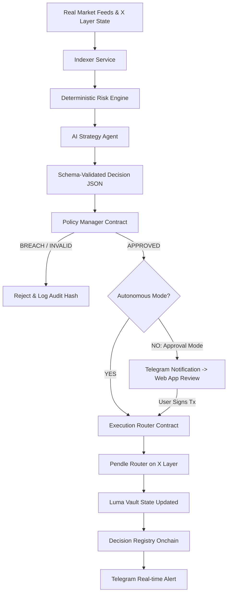

# Luma Finance - Architecture Specification

## Overview
Luma Finance is a production-grade, non-custodial AI-managed RWA (Real World Asset) strategy vault deployed natively on **X Layer** (Chain ID: `196`).

The protocol manages bounded exposure between:
1. **USDG**: An institutional, RWA-backed stable asset.
2. **PT-USDG**: Principal Token exposure associated with the verified USDG market on Pendle on X Layer (Maturity: Oct 29, 2026).

---

## Core Execution Flow

---

## Smart Contract Roles

| Contract | Address / Role | Responsibility |
|---|---|---|
| `LumaVault.sol` | Core Asset Custody | Accepts deposits, mints LP shares, processes direct withdrawals, dispatches authorized rebalances. Has NO arbitrary `call()` doors. |
| `PolicyManager.sol` | Boundary Engine | Enforces user limits (`maxPtAllocationBps`, `maxSingleRebalanceBps`, `maxSlippageBps`), asset allowlists, and staleness checks. |
| `ExecutionRouter.sol` | Whitelisted Swaps | Dedicated integration for Pendle Market swaps (`swapTokenForPt`, `swapPtForToken`). Strictly routes output back to `LumaVault`. |
| `DecisionRegistry.sol` | Audit Trail | Records onchain keccak256 hashes of AI decisions, reason codes, confidence, and timestamps. |

---

## Risk Engine Mathematical Model

Risk scoring is 100% deterministic and versioned:
1. **Liquidity Score ($L$)**: Evaluates pool depth vs total portfolio value ($0-100$).
2. **Price Stability Score ($S$)**: Evaluates USDG peg deviation ($0-100$).
3. **Yield Score ($Y$)**: Compares Pendle implied APY against benchmark yield ($0-100$).
4. **Maturity Urgency ($M$)**: Non-linear function of remaining days to expiry ($0-100$).
5. **Execution Risk ($E$)**: Estimated price impact for target trade size ($0-100$).
6. **Concentration Risk ($C$)**: Ratio of PT to total vault reserves ($0-100$).

### Composite Overall Risk Index:
$$\text{OverallRisk} = \text{round}\left((100 - L) \times 0.25 + (100 - S) \times 0.20 + M \times 0.25 + E \times 0.15 + C \times 0.15\right)$$

---

## Telegram & Web Interface Separation
- **No private keys in Telegram**: Telegram serves exclusively as a transparent notification and explanation interface.
- **Approval Mode**: If autonomous execution is turned off, the AI creates a proposal, notifies the user via Telegram with a deep link to the Web App, where the user reviews and signs using MetaMask, Rabby, or OKX Wallet.
